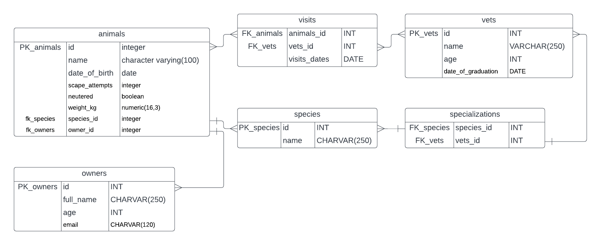

# Vet Clinic databases-project.

## Getting Started

This repository includes files with plain SQL that can be used to recreate a database:

- Use [schema.sql](./schema.sql) to create all tables.
- Use [data.sql](./data.sql) to populate tables with sample data.
- Check [queries.sql](./queries.sql) for examples of queries that can be run on a newly created database. **Important note: this file might include queries that make changes in the database (e.g., remove records). Use them responsibly!**

<a name="readme-top"></a>


<!-- TABLE OF CONTENTS -->

# 📗 Table of Contents

- [📖 About the Project](#about-project)
  - [🛠 Built With](#built-with)
    - [Tech Stack](#tech-stack)
    - [Key Features](#key-features)
- [💻 Getting Started](#getting-started)
  - [Setup](#setup)
  - [Prerequisites](#prerequisites)
  - [Install](#install)
  - [Usage](#usage)
  - [Run tests](#run-tests) `Not available yet`
- [👥 Authors](#authors)
- [🔭 Future Features](#future-features)
- [🤝 Contributing](#contributing)
- [⭐️ Show your support](#support)
- [🙏 Acknowledgements](#acknowledgements)
- [📝 License](#license)

<!-- PROJECT DESCRIPTION -->

# 📖 Vet clinic database <a name="about-project"></a>

> What is Vet Clinic ? 

**Vet clinic** is a relational database project that creates a table to store animals'information, insert some data into it, and query it.



## 🛠 Built With <a name="built-with"></a>

### Tech Stack <a name="tech-stack"></a>

> Learn more about the tech used in this project.

<details>
<summary>Database</summary>
  <ul>
    <li><a href="https://www.postgresql.org/">PostgreSQL</a></li>
  </ul>
</details>

<!-- Features -->

### Key Features <a name="key-features"></a>

> Do you want to know the key features? take a look below!

- **You can use the files to Generate a table**
- **You can save data into the table**
- **You can use the files to query data from the table**

<p align="right">(<a href="#readme-top">back to top</a>)</p>


<!-- GETTING STARTED -->

## 💻 Getting Started <a name="getting-started"></a>

> Do you want to re-create the data base?

To get a local copy up and running, follow these steps.

### Prerequisites

In order to run this project you need to install `PostgreSQL`, you can find more information in the next link: [PostgreSQL](https://www.postgresql.org/download/linux/ubuntu/)

 1. Create the file rpository configuration:
```sh
 sudo sh -c 'echo "deb http://apt.postgresql.org/pub/repos/apt $(lsb_release -cs)-pgdg main" > /etc/apt/sources.list.d/pgdg.list'
```
 2. Import the repository signing key:
 ```sh
   wget --quiet -O - https://www.postgresql.org/media/keys/ACCC4CF8.asc | sudo apt-key add -
 ```

 3. Update the package lists:
 ```sh
   sudo apt-get update
 ```
 4. Install the latest version of PostgreSQL.
 ```sh
  sudo apt-get -y install postgresql
 ```


### Setup

Clone this repository to your desired folder:

```sh
  cd my-folder
  git clone git@github.com:Diegogagan2587/vet-clinic-database.git
```


### Install

Install this project with:

1. To create a new data base, open you terminal (shell or bash)
2. Create a new data base within your terminal, for the next example the new databas will be named `mydb`;
```sh
createdb mydb
```
3. Open your new database in  `psql` :
```sh
psql mydb

```
4. Copy the data from `schema.sql` and paste it in the terminal to initialize all the requrired tables.
5. Copy and paste the data from `data.sql` to update the tables we have just created
6. You can start now experimenting with your own queries.

### Usage

This repos is including pre-defined queries that you can check how they works, 
Just copy and paste the content from `queries.sql`, or you can create your own queries and 
use the mentioned file as a guide.

### Run tests

Not available for this project.


<p align="right">(<a href="#readme-top">back to top</a>)</p>

<!-- AUTHORS -->

## 👥 Authors <a name="authors"></a>

> Below you can find data about creators:

👤 **Dievo Vidal Lopez**

- GitHub: [@Diegogagan2587](https://github.com/Diegogagan2587)
- Twitter: [@dieg02587](https://twitter.com/dieg02587)
- LinkedIn: [Diego Vidal Lopez](https://www.linkedin.com/in/diego-vidal-lopez)

<p align="right">(<a href="#readme-top">back to top</a>)</p>

<!-- FUTURE FEATURES -->

## 🔭 Future Features <a name="future-features"></a>

> Below some features I'm planing to include:

- [ ] **Implement Test**

<p align="right">(<a href="#readme-top">back to top</a>)</p>

<!-- CONTRIBUTING -->

## 🤝 Contributing <a name="contributing"></a>

Contributions, issues, and feature requests are welcome!

Feel free to check the [issues page](https://github.com/Diegogagan2587/vet-clinic-database/issues).

<p align="right">(<a href="#readme-top">back to top</a>)</p>

<!-- SUPPORT -->

## ⭐️ Show your support <a name="support"></a>

> Would you like to show support?

If you like this project feel free to clone it, offer suggestion on issues page or even leave us an star.

<p align="right">(<a href="#readme-top">back to top</a>)</p>

<!-- ACKNOWLEDGEMENTS -->

## 🙏 Acknowledgments <a name="acknowledgements"></a>


I would like to thank Microverse for proposing this activity.

Thanks to learnsql.com for providing documentation, it help to understand this topic:
- [Learn SQL: Data Types ](https://learnsql.com/blog/postgresql-data-types/#:~:text=The%20DECIMAL%20and%20NUMERIC%20data,types%20can%20store%20rational%20numbers.)

<p align="right">(<a href="#readme-top">back to top</a>)</p>


<!-- LICENSE -->

## 📝 License <a name="license"></a>

This project is [MIT](./LICENSE) licensed.

<p align="right">(<a href="#readme-top">back to top</a>)</p>
